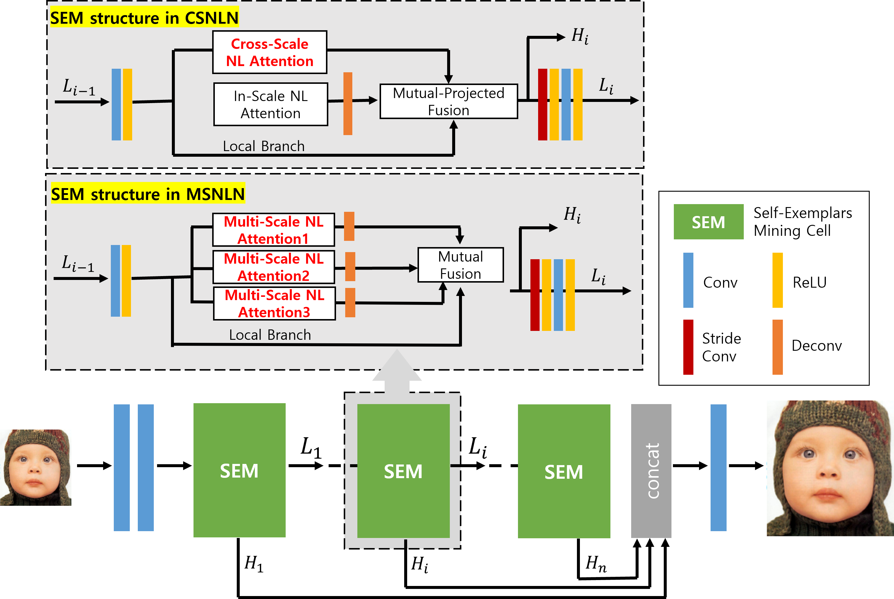

# Multi-Scale Non-Local Attention Network
This repository is for MSNLN  demo introduced in the following repository [MSNLN](https://github.com/Dae12-Han/MSNLN).  

[Sowon Kim](https://github.com/Dae12-Han), Hanhoon Park*, "**Image super-resolution using multi-scale non-local attention**", Journal of Electronic Imaging 32(1), 013043 (24 February 2023), [[Paper]](https://doi.org/10.1117/1.JEI.32.1.013043)


The code is built on [EDSR (PyTorch)](https://github.com/thstkdgus35/EDSR-PyTorch) and [CSNLN](https://github.com/SHI-Labs/Cross-Scale-Non-Local-Attention), tested on window 10 environment (Python3.6.5, PyTorch_1.7.1) with GeForce RTX 2080 Ti GPU. It also needs to install Matplotlib, imageio, tqdm, scikit-image libraries to run this code.

## Contents
1. [Introduction](#introduction)
2. [Train](#train)
3. [Test](#test)
4. [Acknowledgements](#acknowledgements)

## Introduction

Since the deep learning-based methods were proposed, compared with traditional methods, they use large-scale external image priors for SISR. However, still most existing deep convoultion-based SISR works have ignored the long-range feature-wise similarities in natural images. Cross-Scale Non-Local Network (CSNLN) overcomes these problems by capturing recurring small patches in different scale and achieved considerable performance gain. Inspired by CSNLN, we proposed Multi-Scale Non-Local Netowrk (MSNLN). MSNLN adopts the benefits of CSNLN but unlike CSNLN, it is made to capture similarities within the same size of small patches. Experimental results demonstrate that proposed MSNLN shows superior performance over prior CSNLN by multiple SISR benchmarks.



The proposed MSNLN architecture. SEM structure in CSNLN, it fuses features learned from a Cross-Scale Non-Local (CS-NL) attention, with others from In-Scale Non-Local (IS-NL) and the local paths. SEM structure in MSNLN, it fuses features learned from a proposed Multi-Scale Non-Local (MS-NL) attention and the local paths.


## Train
### Prepare training data 

1. Download DIV2K training data (800 training + 100 validtion images) from [DIV2K dataset](https://data.vision.ee.ethz.ch/cvl/DIV2K/) or [SNU_CVLab](https://cv.snu.ac.kr/research/EDSR/DIV2K.tar).

2. Specify '--dir_data' based on the HR and LR images path. 

Code is based on EDSR and CSNLN. For more information, please refer to [EDSR(PyTorch)](https://github.com/thstkdgus35/EDSR-PyTorch) or [CSNLN](https://github.com/SHI-Labs/Cross-Scale-Non-Local-Attention).

### Run

    ```
    # Example X2 SR
    python3 main.py --chop --batch_size 4 --model MSNLN_631_3 --scale 2 --patch_size 64 --save MSNLN_631_3_x2 --n_feats 128 --depth 12 --data_train DIV2K --save_models
    ```

## Test
### Demo
Here we provide demo test samples. Since Set5 dataset is consisted of 5 images, we randomly extracted 10 images from B100, Detroit, Manga109. You can check that demo datasets PSNR average is over 37dB. 

    ```
    # No self-ensemble: MSNLN
    # Example X2 SR
    # Sample test datasets: Set5, B100, Manga109, Detroit
    python3 main.py --model MSNLN_631_3 --data_test Set5+B100+Detroit+Manga109 --data_range 801-900 --scale 2 --n_feats 128 --depth 12 --pre_train ./experiment/MSNLN_631_3_x2/model/model_best.pt --save_results --test_only --chop
    ```
Making model...  
Loading model from ./experiment/MSNLN_631_3_x2/model/model_best.pt  
Total params: 3.68M  
  
Evaluation:  
100%|█████████████████████████████████████████████| 5/5 [00:47<00:00, 10.11s/it]  
[Set5 x2]       PSNR: 37.248 
Forward: 47.14s  
100%|███████████████████████████████████████████| 10/10 [02:17<00:00, 13.71s/it]  
[B100 x2]       PSNR: 35.923 
Forward: 137.43s  
100%|███████████████████████████████████████████| 10/10 [15:42<00:00, 94.19s/it]  
[Manga109 x2]   PSNR: 39.715
Forward: 942.34s   
100%|███████████████████████████████████████████| 10/10 [03:49<00:00, 22.85s/it]  
[Detroit x2]    PSNR: 41.345 
Forward: 229.33s  


## Acknowledgements
This code is built on [EDSR (PyTorch)](https://github.com/thstkdgus35/EDSR-PyTorch) and [CSNLN](https://github.com/SHI-Labs/Cross-Scale-Non-Local-Attention). We thank the authors for sharing their codes.

